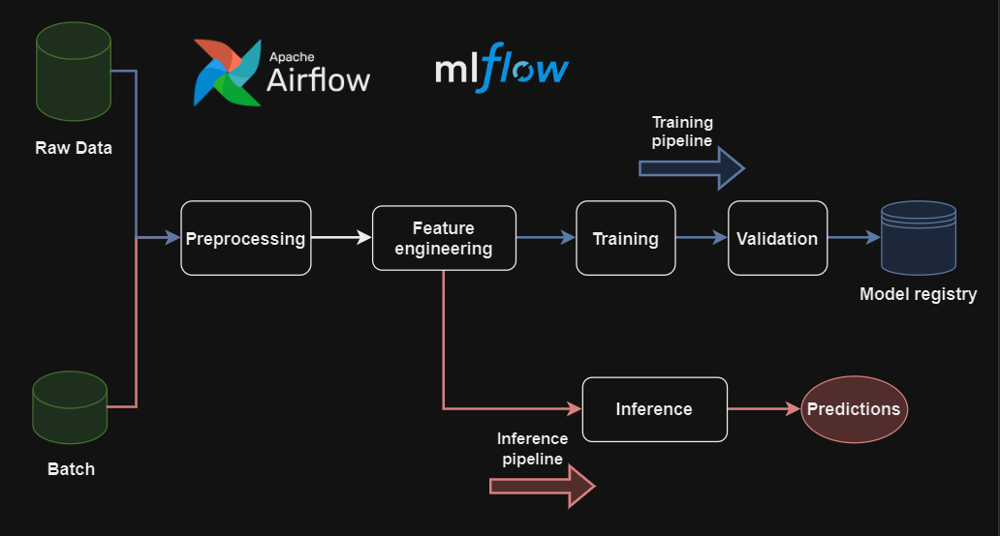
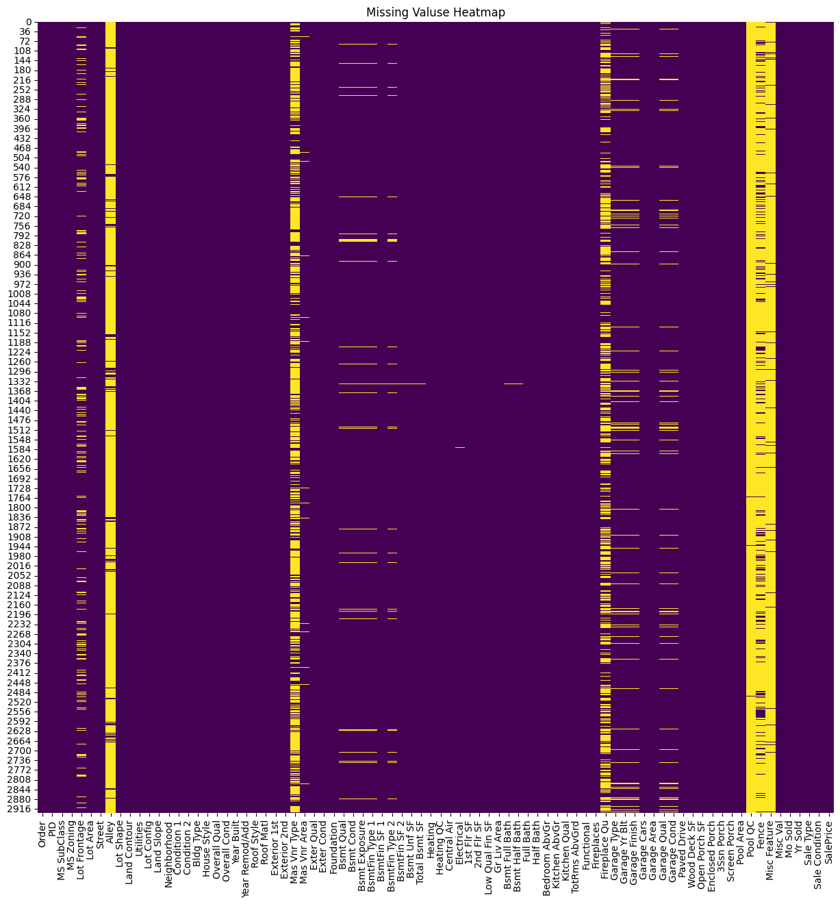
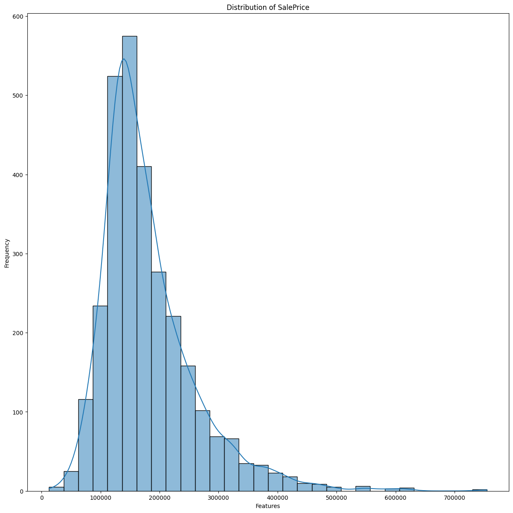
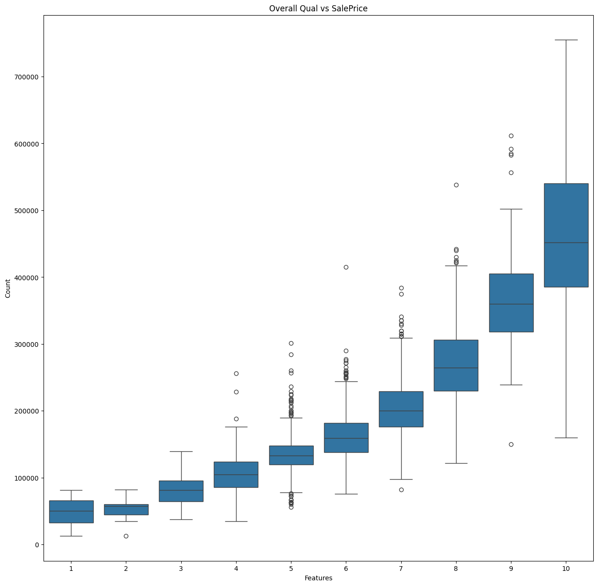
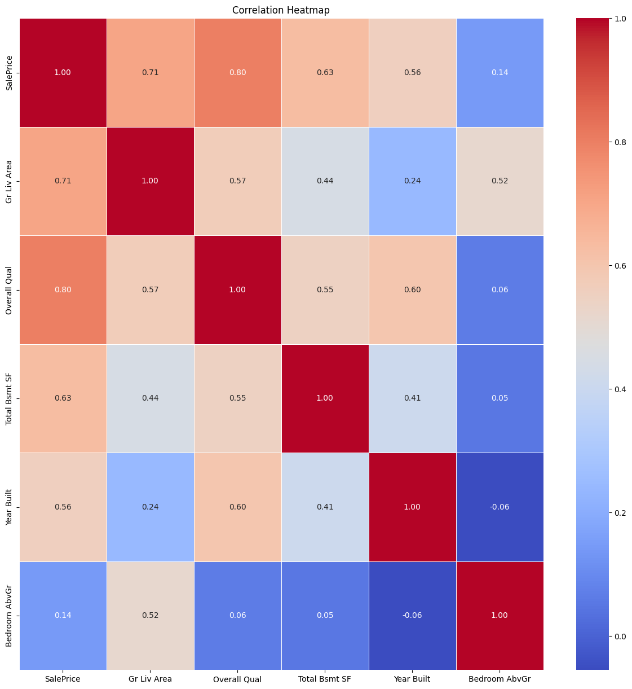
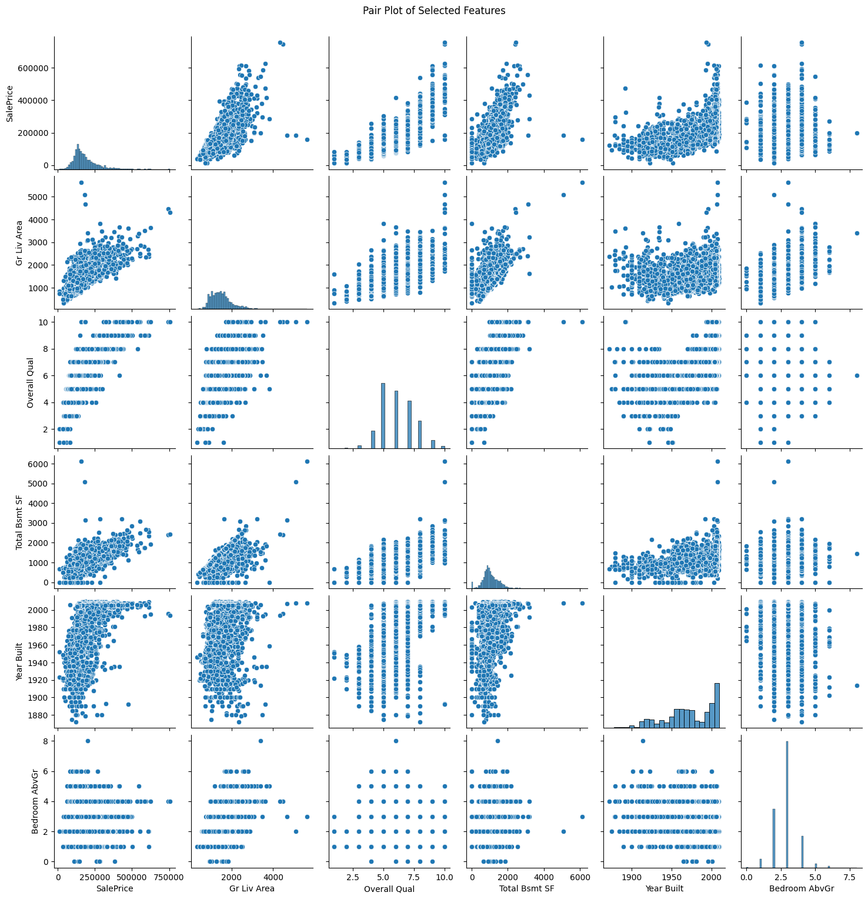

# HomePricePredict-E2E: Production MLOps Pipeline

A comprehensive end-to-end MLOps pipeline for house price prediction, leveraging modern software engineering design patterns and best practices.

## Project Overview

HomePricePredict-E2E is a production-grade machine learning pipeline that demonstrates the complete lifecycle of a machine learning project from data ingestion to model deployment. The project uses MLflow for experiment tracking and ZenML for pipeline orchestration, ensuring reproducibility, scalability, and maintainability.

### ZenML Pipeline Architecture

## Features

- End-to-end ML pipeline for house price prediction
- Modular components using design patterns (Factory, Strategy, Template)
- Comprehensive data preprocessing and feature engineering
- Automated experiment tracking with MLflow
- Production deployment with monitoring capabilities
- CI/CD integration for automated model updates

## Pipeline Stages

### 1. Data Ingestion

The data ingestion component utilizes the Factory design pattern to provide flexible integration with multiple data sources. This modular approach allows the pipeline to seamlessly acquire housing data from various sources while maintaining a consistent interface.

### 2. Data Analysis & Preprocessing

Exploratory data analysis reveals key insights about house price determinants. The preprocessing phase handles missing values and outliers to ensure data quality.

#### Missing Values Analysis

#### SalePrice Distribution

SalePrice distribution shows skewness that required to be handled by normalization 

#### Quality vs SalePrice Relationship

#### Correlation Analysis

#### Feature Relationships

### 3. Feature Engineering

The feature engineering pipeline employs the Strategy design pattern to dynamically apply different transformation techniques based on feature characteristics. This approach allows for specialized handling of numerical, categorical, and ordinal features while maintaining clean separation of concerns.

### 4. Model Building

Model development follows the Template design pattern, providing a consistent framework for experimenting with different algorithms while standardizing the training workflow. This architecture enables systematic comparison of various regression models within the MLflow tracking environment.

### 5. Model Evaluation

Models are evaluated using industry-standard metrics including RMSE, MAE, and R². All experiments are tracked in MLflow, facilitating easy comparison between approaches and enabling data-driven model selection.

### 6. Deployment

The final model is deployed as a production service using ZenML's deployment capabilities. The system includes continuous monitoring for performance metrics and data drift detection. CI/CD pipelines ensure the model remains up-to-date as new housing data becomes available.

## Installation & Usage

### Prerequisites

- Python 3.8+
- Docker
- Git

### Setup

1. Clone the repository
2. Install dependencies: `pip install -r requirements.txt`
3. Configure ZenML: `zenml init`
4. Run the pipeline: `python src/main.py`

## License

This project is licensed under the MIT License.

## Acknowledgments

- Housing dataset from [source]
- Inspired by best practices in MLOps
